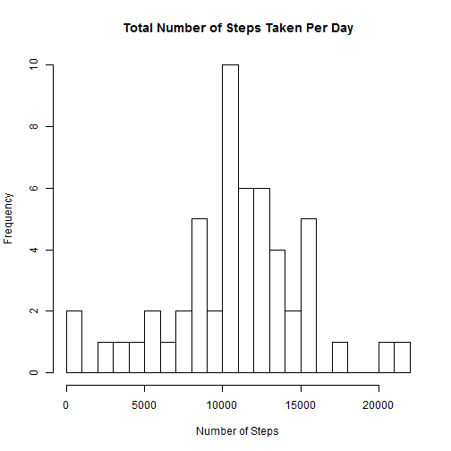
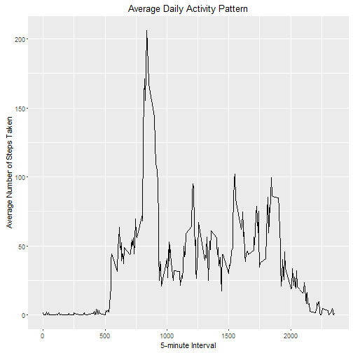
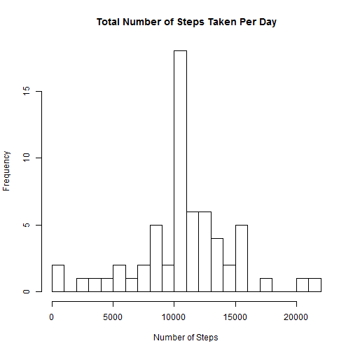
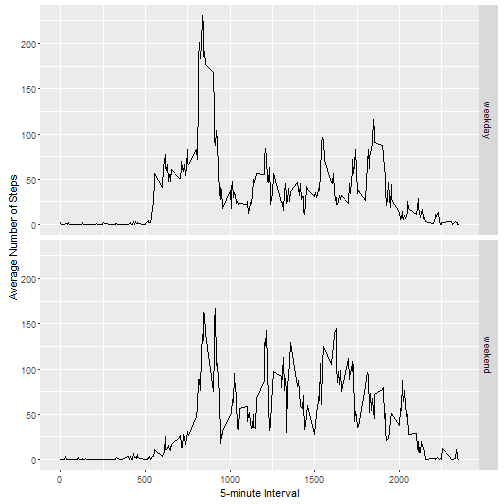

---
output:
  html_document: default
  pdf_document: default
  word_document: default
---
# Reproducible Data - Course Project 1


## Introduction
It is now possible to collect a large amount of data about personal movement using activity monitoring devices such as a Fitbit, Nike Fuelband, or Jawbone Up. These type of devices are part of the "quantified self" movement - a group of enthusiasts who take measurements about themselves regularly to improve their health, to find patterns in their behavior, or because they are tech geeks. But these data remain under-utilized both because the raw data are hard to obtain and there is a lack of statistical methods and software for processing and interpreting the data.

This assignment makes use of data from a personal activity monitoring device. This device collects data at 5 minute intervals through out the day. The data consists of two months of data from an anonymous individual collected during the months of October and November, 2012 and include the number of steps taken in 5 minute intervals each day.

The data for this assignment can be downloaded from the course web site:

Dataset: Activity monitoring data [52K]

The variables included in this dataset are:

.steps: Number of steps taking in a 5-minute interval (missing values are coded as NA)

.date: The date on which the measurement was taken in YYYY-MM-DD format

.interval: Identifier for the 5-minute interval in which measurement was taken

## Load and Preprocess Activity Monitoring Data

```r
unzip(zipfile="repdata_data_activity.zip")
Activity <- read.csv("activity.csv", header = TRUE)
```

## What is mean total number of steps taken per day?

```r
Activity_NoNA <- Activity[complete.cases(Activity),]
StepsPerDay <- tapply(Activity_NoNA$steps, Activity_NoNA$date, FUN = sum, na.rm = TRUE, simplify=T)
hist(StepsPerDay,breaks = 20, xlab = "Number of Steps", main = "Total Number of Steps Taken Per Day")
```



#### Mean and median of the total number of steps taken per day

```r
as.integer(mean(StepsPerDay, na.rm = TRUE))
```

```
## [1] 10766
```

```r
as.integer(median(StepsPerDay, na.rm = TRUE))
```

```
## [1] 10765
```

## What is the average daily activity pattern?

```r
library(ggplot2)
AvgSteps <- aggregate(x=list(steps = Activity$steps), by = list(interval = Activity$interval), 
    FUN = mean, na.rm = TRUE)
ggplot(data = AvgSteps, aes(x = interval, y = steps)) + 
    geom_line() +
    xlab("5-minute Interval") + 
    ylab("Average Number of Steps Taken") +
    ggtitle("Average Daily Activity Pattern")
```



```r
AvgSteps[which.max(AvgSteps$steps), ]
```

```
##     interval    steps
## 104      835 206.1698
```
Interval 835, on average across all the days in the dataset, contains the maximum number of steps at 206.

## Imputing Missing Values

```r
nrow(Activity[is.na(Activity$steps),])
```

```
## [1] 2304
```
The total number of rows with missing data is 2304.

Strategy for filling each missing value with the mean value of its 5-minute interval.

```r
Activity_fill <- function(steps, interval) {
    filled <- NA
    if (!is.na(steps)) 
        filled <- c(steps) else filled <- (AvgSteps[AvgSteps$interval == interval, "steps"])
    return(filled)
}
Activity_full <- Activity
Activity_full$steps <- mapply(Activity_fill, Activity_full$steps, Activity_full$interval)

TotalSteps <- tapply(Activity_full$steps, Activity_full$date, FUN = sum, na.rm = TRUE, simplify=T)
hist(TotalSteps,breaks = 20, xlab = "Number of Steps", main = "Total Number of Steps Taken Per Day")
```



#### Mean and median of the total number of steps taken per day

```r
as.integer(mean(TotalSteps, na.rm = TRUE))
```

```
## [1] 10766
```

```r
as.integer(median(TotalSteps, na.rm = TRUE))
```

```
## [1] 10766
```
The original mean and median estimates were 10766 and 10765, respectively. After imputing the missing data on the estimates of the total daily number of steps, the mean did not change, but it increased the median from 10765 to 10766. The other impact is that it has caused a higher frquency count in the center area of the histogram.

### Are there differences in activity patterns between weekdays and weekends?

```r
WeekdayWeekendStatus <- function(date) {
    day <- weekdays(date)
    if (day %in% c("Monday", "Tuesday", "Wednesday", "Thursday", "Friday")) 
        return("weekday") else if (day %in% c("Saturday", "Sunday")) 
        return("weekend") else stop("invalid date")
}
Activity_full$date <- as.Date(Activity_full$date)
Activity_full$day <- sapply(Activity_full$date, WeekdayWeekendStatus)


averages <- aggregate(steps ~ interval + day, data = Activity_full, mean)
ggplot(averages, aes(interval, steps)) + geom_line() + 
    facet_grid(day ~ .) + 
    xlab("5-minute Interval") + 
    ylab("Average Number of Steps")
```




